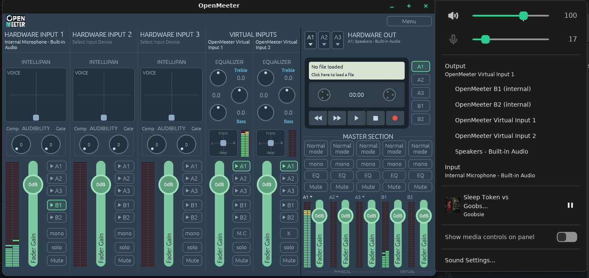
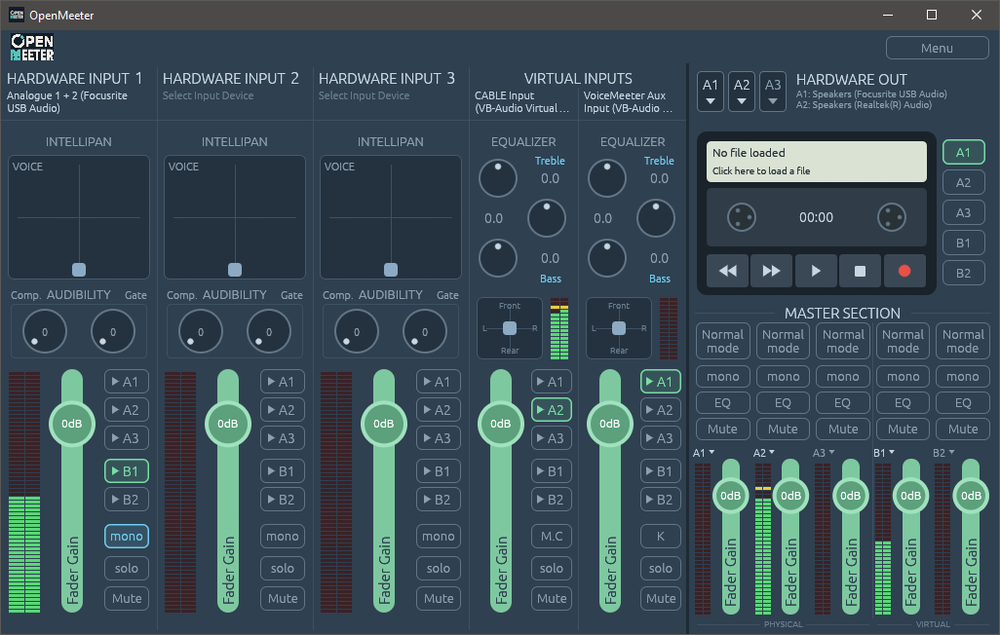

# OpenMeeter

A Voicemeeter-style audio mixer for Windows and Linux. Windows requires `VB-Cable`/`VAC` and Linux requires `PipeWire`/`PulseAudio`

## Status

- [x] Windows device enumeration, VB-Cable detection
- [x] Windows mixing engine: capture → mix → render, gain/mute/mono/solo, routing, real meters, feedback-loop guard
- [x] Recorder: arm inputs (pre-fader) or buses (post-fader), WAV 16/24/32f, mono/stereo, multitrack,
      auto-stop; play WAV/MP3/FLAC/OGG/M4A into buses with gain, loop and play-on-load
- [x] Menu: restart / auto-restart engine, presets (load, save, load on startup), reset, system tray,
      run on startup, start hidden, always on top, lock UI, system settings (buffer size, strip names)
- [x] Windows: per-output exclusive mode (bypasses the Windows mixer and effects, like Voicemeeter)
- [x] Windows: outputs play in raw mode, bypassing device effects (Realtek "enhancements", virtual surround, loudness) without taking the device exclusively
- [x] Macro buttons: global hotkeys (e.g. Ctrl+F12, Numpad7) to restart the engine, play a sound clip, stop playback, start/stop recording or toggle a mute (X11 only on Linux)
- [ ] MIDI mapping, VBAN
- [x] Linux backend: device enumeration, virtual inputs/buses created on demand, mixing engine,
      meters, recorder and player, feedback guard, unplug detection, real-time audio threads, tray icon
- [ ] EQ/comp/gate/pan DSP
- [ ] Per-app routing

## Linux Quickstart



On Linux, virtual devices appear in every app's device list while OpenMeeter runs:
play into **OpenMeeter Input v1** (e.g. set it as your default output) and record
from **OpenMeeter Out B1** (e.g. as Discord's microphone). They are removed on exit.

## Windows 10+ Quickstart



You will need some virtual audio drivers. If you're looking for a free version:

[Cable 1 (VB Cable)](https://vb-audio.com/Cable/)

[Cable 2 (VAC)](https://vac.muzychenko.net/en/download.htm)

> If you're wanting more than 2 audio channels, you can pay a small fee for either. Signing audio drivers on Windows is actually mad expensive, which is why it is not possible to create a free/FOSS version.

Install both cables. They should show as sound drivers like so:


Make one of them the default for `Playback`, and one default for `Recording`.

> Don't forget to tinker with `Properties` > `Advanced` to make sure you have the right sample rate!

In `OpenMeeter`:

1.) First select your audio hardware. You can select your output devices in the top right in `HARDWARE OUT`, where each devices takes a channel (A1-A3). For your input devices, Select your driver for `HARDWARE INPUT`.

2.) For `Virtual Inputs`, Select `CABLE Input`. In the screenshot above, you'll see its selected for the first Virtual Input.

3.) For `Master Section`, select one of the last second columns (B1,B2) and select `LINE 1`.

4.) Make sure your devices are on the right channels. In the screenshot, I have the `CABLE Input` outputting to `A1`(speakers) and I have `Focusrite USB Audio Mic` outputting to `B1`, which is `LINE 1`

## Running locally

```
cargo run                      # GUI with the platform backend
cargo run -- --mock            # GUI with a fake backend (any OS)
cargo run -- devices           # list audio devices
cargo run -- doctor            # check for problems (e.g. VB-Cable missing)
cargo run -- meters            # run the mixer headless and print meter levels
cargo run -- record --seconds 30 [--play song.mp3]   # headless recording
```

Ubuntu/Debian build deps: 
```bash
sudo apt install libpulse-dev libgtk-3-dev libayatana-appindicator3-dev pkg-config
```

> backend needs `pactl` (`pulseaudio-utils`), which comes with PipeWire, normally
Audio threads ask for real-time scheduling (directly, or through RealtimeKit); `meters` shows what they got.

With the system tray on, the window runs through XWayland on Wayland desktops: Wayland doesn't let
apps hide their windows, which closing to the tray needs.
